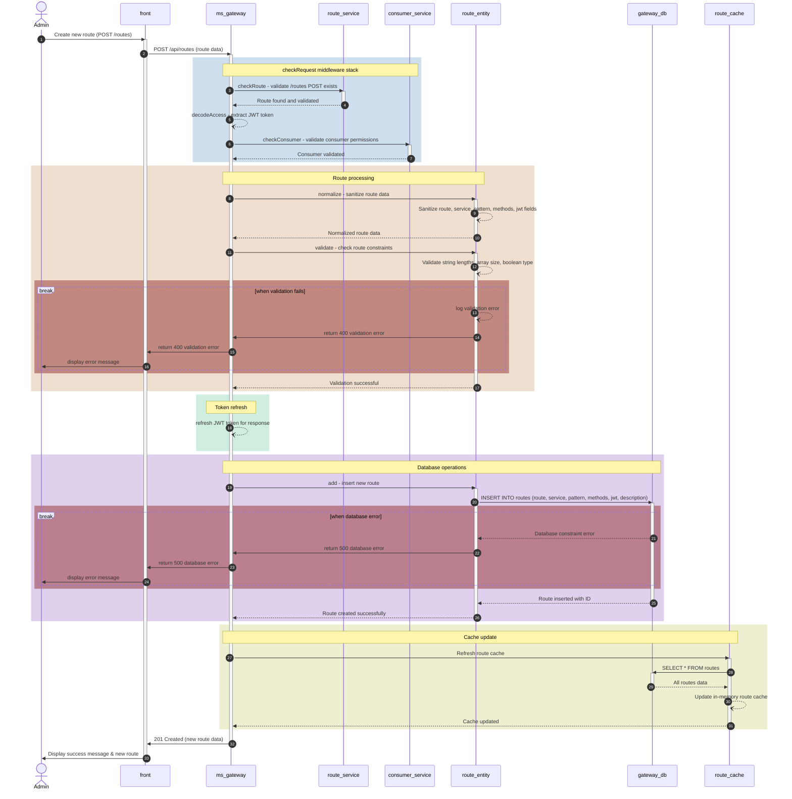

```mermaid
---
caption: Sequence diagram for admin creating a new route
---

sequenceDiagram
  autonumber
  actor a as Admin
  participant f as front
  participant gw as ms_gateway
  participant rs as route_service
  participant cs as consumer_service
  participant re as route_entity
  participant gdb as gateway_db
  participant cache as route_cache
  
  a->>f: Create new route (POST /routes)
  activate f
  
  f->>gw: POST /api/routes (route data)
  activate gw
  
  rect rgb(100, 150, 200, 0.3)
    note over gw,cs: checkRequest middleware stack
    gw->>rs: checkRoute - validate /routes POST exists
    activate rs
    rs-->>gw: Route found and validated
    deactivate rs
    
    gw--)gw: decodeAccess - extract JWT token
    
    gw->>cs: checkConsumer - validate consumer permissions
    activate cs
    cs-->>gw: Consumer validated
    deactivate cs
  end
  
  rect rgb(200, 150, 100, 0.3)
    note over gw,re: Route processing
    gw->>re: normalize - sanitize route data
    activate re
    re--)re: Sanitize route, service, pattern, methods, jwt fields
    re-->>gw: Normalized route data
    deactivate re
    
    gw->>re: validate - check route constraints
    activate re
    re--)re: Validate string lengths, array size, boolean type
    
    rect rgb(150, 50, 50, 0.5)
      break when validation fails
        re--)re: log validation error
        re->>gw: return 400 validation error
        gw->>f: return 400 validation error
        f->>a: display error message
      end
    end
    
    re-->>gw: Validation successful
    deactivate re
  end
  
  rect rgb(100, 200, 150, 0.3)
    note over gw: Token refresh
    gw--)gw: refresh JWT token for response
  end
  
  rect rgb(150, 100, 200, 0.3)
    note over gw,gdb: Database operations
    gw->>re: add - insert new route
    activate re
    
    re->>gdb: INSERT INTO routes (route, service, pattern, methods, jwt, description)
    activate gdb
    
    rect rgb(150, 50, 50, 0.5)
      break when database error
        gdb-->>re: Database constraint error
        re->>gw: return 500 database error
        gw->>f: return 500 database error
        f->>a: display error message
      end
    end
    
    gdb-->>re: Route inserted with ID
    deactivate gdb
    
    re-->>gw: Route created successfully
    deactivate re
  end
  
  rect rgb(200, 200, 100, 0.3)
    note over gw,cache: Cache update
    gw->>cache: Refresh route cache
    activate cache
    cache->>gdb: SELECT * FROM routes
    activate gdb
    gdb-->>cache: All routes data
    deactivate gdb
    cache--)cache: Update in-memory route cache
    cache-->>gw: Cache updated
    deactivate cache
  end
  
  gw->>f: 201 Created (new route data)
  deactivate gw
  
  f->>a: Display success message & new route
  deactivate f
```