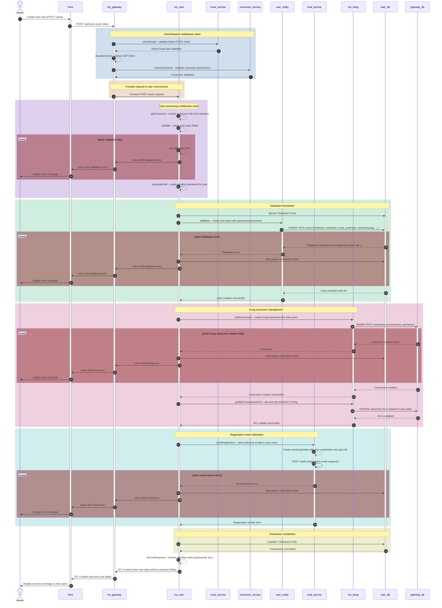

```mermaid
---
caption: Sequence diagram for admin creating a new user
---

sequenceDiagram
  autonumber
  actor a as Admin
  participant f as front
  participant gw as ms_gateway
  participant us as ms_user
  participant rs as route_service
  participant cs as consumer_service
  participant ue as user_entity
  participant ms as mail_service
  participant kong as ms_kong
  participant udb as user_db
  participant gdb as gateway_db
  
  a->>f: Create new user (POST /users)
  activate f
  
  f->>gw: POST /api/users (user data)
  activate gw
  
  rect rgb(100, 150, 200, 0.3)
    note over gw,cs: checkRequest middleware stack
    gw->>rs: checkRoute - validate /users POST exists
    activate rs
    rs-->>gw: Route found and validated
    deactivate rs
    
    gw--)gw: decodeAccess - extract JWT token
    
    gw->>cs: checkConsumer - validate consumer permissions
    activate cs
    cs-->>gw: Consumer validated
    deactivate cs
  end
  
  rect rgb(200, 150, 100, 0.3)
    note over gw,us: Forward request to user microservice
    gw->>us: Forward POST /users request
    activate us
  end
  
  rect rgb(150, 100, 200, 0.3)
    note over us: User processing middleware stack
    us--)us: getConsumer - extract consumer info from headers
    
    us--)us: validate - check user input fields
    
    rect rgb(150, 50, 50, 0.5)
      break when validation fails
        us--)us: log validation error
        us->>gw: return 400 validation error
        gw->>f: return 400 validation error
        f->>a: display error message
      end
    end
    
    us--)us: generatePwd - create random password for user
  end
  
  rect rgb(100, 200, 150, 0.3)
    note over us,udb: Database transaction
    us->>udb: BEGIN TRANSACTION
    activate udb
    
    us->>ue: addMany - insert new users with generated passwords
    activate ue
    
    ue->>udb: INSERT INTO users (firstName, lastName, email, pwdHash, rolesArrayAgg, ...)
    
    rect rgb(150, 50, 50, 0.5)
      break when database error
        udb-->>ue: Database constraint error (duplicate email, etc.)
        ue-->>us: Database error
        us->>udb: ROLLBACK TRANSACTION
        us->>gw: return 500 database error
        gw->>f: return 500 database error
        f->>a: display error message
      end
    end
    
    udb-->>ue: Users inserted with IDs
    ue-->>us: User creation successful
    deactivate ue
  end
  
  rect rgb(200, 100, 150, 0.3)
    note over us,kong: Kong consumer management
    us->>kong: addConsumers - create Kong consumers for new users
    activate kong
    
    kong->>gdb: INSERT INTO consumers (consumerId, username)
    activate gdb
    
    rect rgb(150, 50, 50, 0.5)
      break when Kong consumer creation fails
        gdb-->>kong: Consumer creation error
        kong-->>us: Kong error
        us->>udb: ROLLBACK TRANSACTION
        us->>gw: return 500 Kong error
        gw->>f: return 500 Kong error
        f->>a: display error message
      end
    end
    
    gdb-->>kong: Consumers created
    deactivate gdb
    kong-->>us: Consumer creation successful
    deactivate kong
    
    us->>kong: updateConsumersACLs - set user permissions in Kong
    activate kong
    kong->>gdb: UPDATE consumer ACLs based on user roles
    activate gdb
    gdb-->>kong: ACLs updated
    deactivate gdb
    kong-->>us: ACL update successful
    deactivate kong
  end
  
  rect rgb(100, 200, 200, 0.3)
    note over us,ms: Registration email notification
    us->>ms: sendRegistration - send welcome emails to new users
    activate ms
    
    ms--)ms: Create email payloads with user credentials and app info
    
    ms->>ms: POST /mails (registration email requests)
    
    rect rgb(150, 50, 50, 0.5)
      break when email service error
        ms-->>us: Email service error
        us->>udb: ROLLBACK TRANSACTION
        us->>gw: return 500 email error
        gw->>f: return 500 email error
        f->>a: display error message
      end
    end
    
    ms-->>us: Registration emails sent
    deactivate ms
  end
  
  rect rgb(200, 200, 100, 0.3)
    note over us,udb: Transaction completion
    us->>udb: COMMIT TRANSACTION
    udb-->>us: Transaction committed
    deactivate udb
  end
  
  us--)us: secureResponse - remove sensitive data (passwords, etc.)
  
  us->>gw: 201 Created (new user data without sensitive fields)
  deactivate us
  
  gw->>f: 201 Created (secured user data)
  deactivate gw
  
  f->>a: Display success message & new users
  deactivate f
```