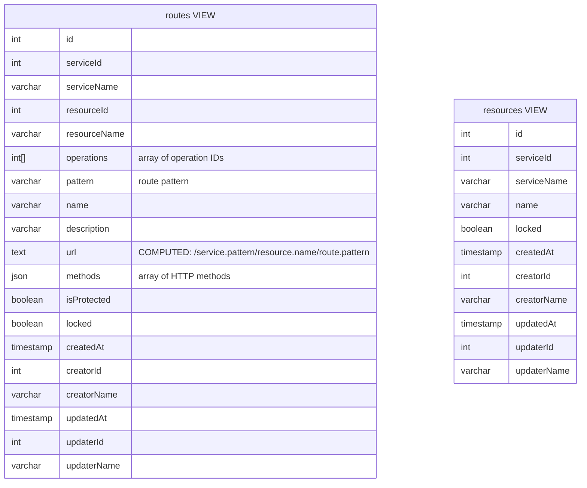

```mermaid
---
caption: Views Entity Relationship Diagram 
---

erDiagram

  routes["routes VIEW"] {
    int id
    int serviceId
    varchar serviceName
    int resourceId
    varchar resourceName
    int[] operations "array of operation IDs"
    varchar pattern "route pattern"
    varchar name
    varchar description
    text url "COMPUTED: /service.pattern/resource.name/route.pattern"
    json methods "array of HTTP methods"
    boolean isProtected
    boolean locked
    timestamp createdAt
    int creatorId
    varchar creatorName
    timestamp updatedAt
    int updaterId
    varchar updaterName
  }

  resources["resources VIEW"] {
    int id
    int serviceId
    varchar serviceName
    varchar name
    boolean locked
    timestamp createdAt
    int creatorId
    varchar creatorName
    timestamp updatedAt
    int updaterId
    varchar updaterName
  }
```
