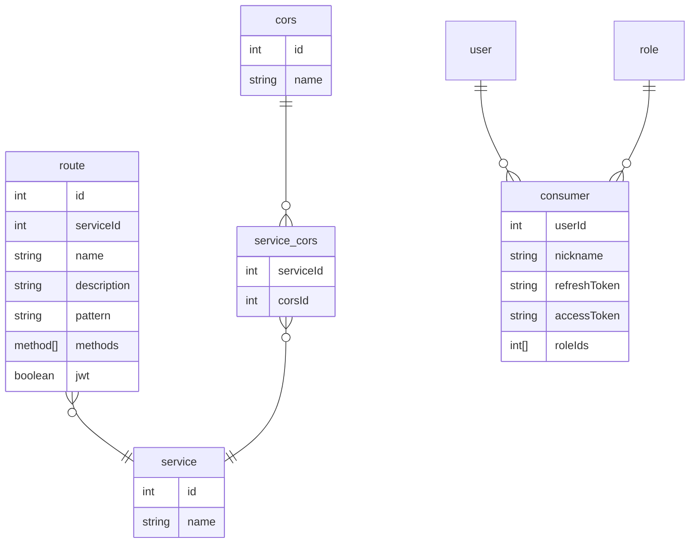

```mermaid
---
caption: Entity Relationship Diagram 
---

erDiagram
  
  route }o--|| service : ""
  service_cors }o--|| service : ""
  cors ||--o{ service_cors : ""  
  user ||--o{ consumer : ""
  role ||--o{ consumer : ""

  service {
    int id
    string name
  }

  cors {
    int id
    string name
  }

  service_cors {
    int serviceId
    int corsId
  }

  route {
    int id
    int serviceId
    string name
    string description
    string pattern
    method[] methods
    boolean jwt
  }

  consumer {
    int userId
    string nickname
    string refreshToken
    string accessToken
    int[] roleIds
  }

  user {}
  role {}

```