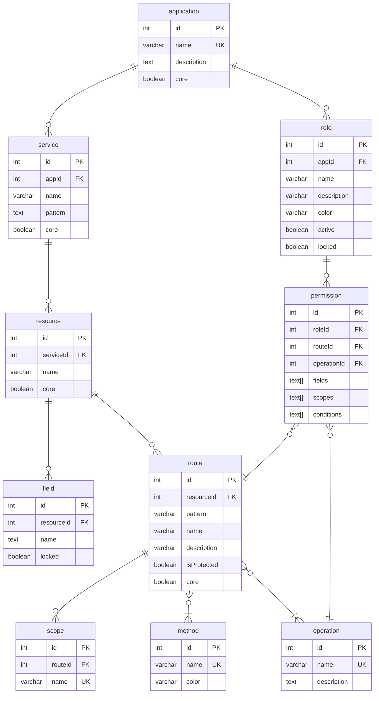
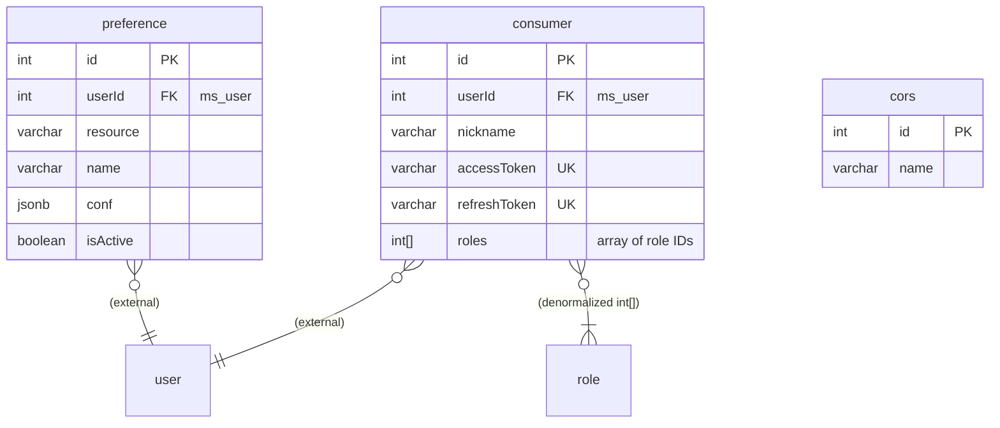

```mermaid
---
caption: Entity Relationship Diagram - Routes & ACL
---

erDiagram

  application ||--o{ service : ""
  application ||--o{ role : ""
  service ||--o{ resource : ""
  role ||--o{ permission : ""
  resource ||--o{ field : ""
  resource ||--o{ route : ""
  route ||--o{ scope : ""
  route }o--|{ method : ""
  route }o--|{ operation : ""

  permission }o--|| route : ""
  permission }o--|| operation : ""

  application {
    int id PK
    varchar name UK
    text description
    boolean core
  }

  role {
    int id PK
    int appId FK
    varchar name
    varchar description
    varchar color
    boolean active
    boolean locked
  }

  permission {
    int id PK
    int roleId FK
    int routeId FK
    int operationId FK
    text[] fields
    text[] scopes
    text[] conditions
  }

  service {
    int id PK
    int appId FK
    varchar name
    text pattern
    boolean core
  }

  resource {
    int id PK
    int serviceId FK
    varchar name
    boolean core
  }

  route {
    int id PK
    int resourceId FK
    varchar pattern
    varchar name
    varchar description
    boolean isProtected
    boolean core
  }

  method {
    int id PK
    varchar name UK
    varchar color
  }

  operation {
    int id PK
    varchar name UK
    text description
  }

  field {
    int id PK
    int resourceId FK
    text name
    boolean locked
  }

  scope {
    int id PK
    int routeId FK
    varchar name UK
  }
```

```mermaid
---
caption: Entity Relationship Diagram - Consumer & Preferences
---

erDiagram

  consumer }o--|| user : "(external)"
  consumer }o--|{ role : "(denormalized int[])"
  preference }o--|| user : "(external)"

  cors {
    int id PK
    varchar name
  }

  consumer {
    int id PK
    int userId FK "ms_user"
    varchar nickname
    varchar accessToken UK
    varchar refreshToken UK
    int[] roles "array of role IDs"
  }

  preference {
    int id PK
    int userId FK "ms_user"
    varchar resource
    varchar name
    jsonb conf
    boolean isActive
  }

  user {

  }

  role {

  }
```
