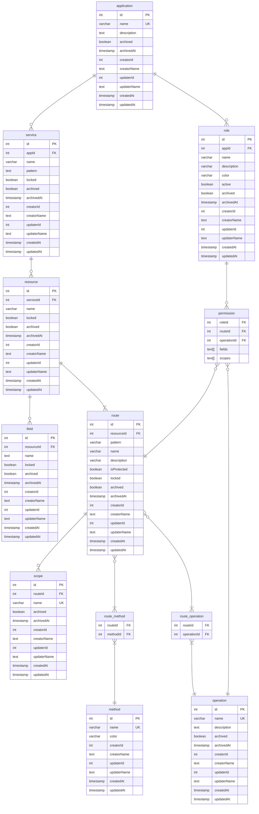
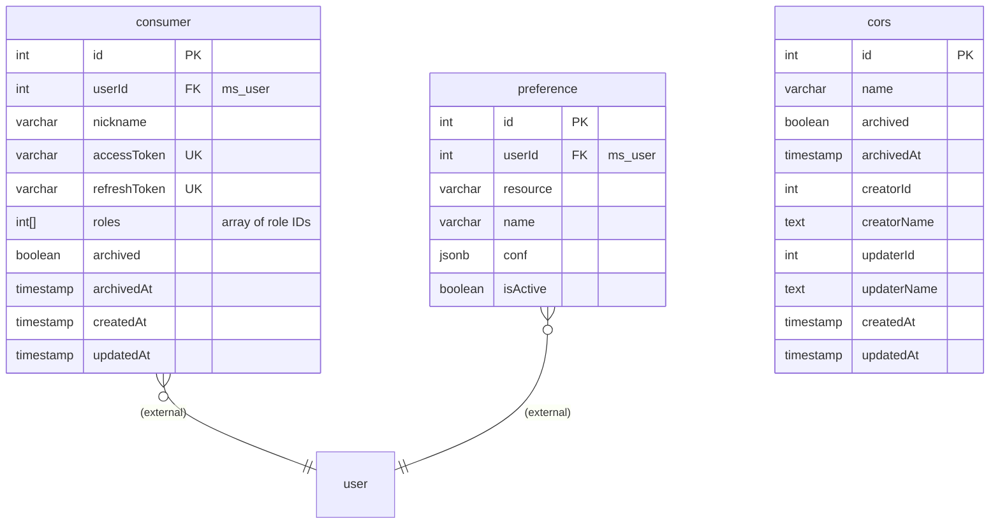

```mermaid
---
caption: Entity Relationship Diagram - Routes & ACL
---

erDiagram

  application ||--o{ service : ""
  service ||--o{ resource : ""
  application ||--o{ role : ""
  role ||--o{ permission : ""
  resource ||--o{ field : ""
  resource ||--|{ route : ""
  route ||--o{ scope : ""
  route }o--|{ route_method : ""
  route_method }|--|| method : ""
  route }o--|{ route_operation : ""
  route_operation }|--|| operation : ""
  
  permission }o--|| route : ""
  permission }o--|| operation : ""

  role {
    int id PK
    int appId FK
    varchar name
    varchar description
    varchar color
    boolean active
    boolean archived
    timestamp archivedAt
    int creatorId
    text creatorName
    int updaterId
    text updaterName
    timestamp createdAt
    timestamp updatedAt
  }

  application {
    int id PK
    varchar name UK
    text description
    boolean archived
    timestamp archivedAt
    int creatorId
    text creatorName
    int updaterId
    text updaterName
    timestamp createdAt
    timestamp updatedAt
  }

  permission {
    int roleId FK
    int routeId FK
    int operationId FK
    text[] fields
    text[] scopes
  }

  service {
    int id PK
    int appId FK
    varchar name
    text pattern
    boolean locked
    boolean archived
    timestamp archivedAt
    int creatorId
    text creatorName
    int updaterId
    text updaterName
    timestamp createdAt
    timestamp updatedAt
  }

  resource {
    int id PK
    int serviceId FK
    varchar name
    boolean locked
    boolean archived
    timestamp archivedAt
    int creatorId
    text creatorName
    int updaterId
    text updaterName
    timestamp createdAt
    timestamp updatedAt
  }

  route {
    int id PK
    int resourceId FK
    varchar pattern
    varchar name
    varchar description
    boolean isProtected
    boolean locked
    boolean archived
    timestamp archivedAt
    int creatorId
    text creatorName
    int updaterId
    text updaterName
    timestamp createdAt
    timestamp updatedAt
  }

  route_method {
    int routeId FK
    int methodId FK
  }

  method {
    int id PK
    varchar name UK
    varchar color
    int creatorId
    text creatorName
    int updaterId
    text updaterName
    timestamp createdAt
    timestamp updatedAt
  }

  route_operation {
    int routeId FK
    int operationId FK
  }

  operation {
    int id PK
    varchar name UK
    text description
    boolean archived
    timestamp archivedAt
    int creatorId
    text creatorName
    int updaterId
    text updaterName
    timestamp createdAt
    timestamp updatedAt
  }

  field {
    int id PK
    int resourceId FK
    text name
    boolean locked
    boolean archived
    timestamp archivedAt
    int creatorId
    text creatorName
    int updaterId
    text updaterName
    timestamp createdAt
    timestamp updatedAt
  }

  scope {
    int id PK
    int routeId FK
    varchar name UK
    boolean archived
    timestamp archivedAt
    int creatorId
    text creatorName
    int updaterId
    text updaterName
    timestamp createdAt
    timestamp updatedAt
  }
```

```mermaid
---
caption: Entity Relationship Diagram - Consumer & Preferences
---

erDiagram

  consumer }o--|| user : "(external)"
  preference }o--|| user : "(external)"

  cors {
    int id PK
    varchar name
    boolean archived
    timestamp archivedAt
    int creatorId
    text creatorName
    int updaterId
    text updaterName
    timestamp createdAt
    timestamp updatedAt
  }

  consumer {
    int id PK
    int userId FK "ms_user"
    varchar nickname
    varchar accessToken UK
    varchar refreshToken UK
    int[] roles "array of role IDs"
    boolean archived
    timestamp archivedAt
    timestamp createdAt
    timestamp updatedAt
  }

  preference {
    int id PK
    int userId FK "ms_user"
    varchar resource
    varchar name
    jsonb conf
    boolean isActive
  }

  user {

  }
```
