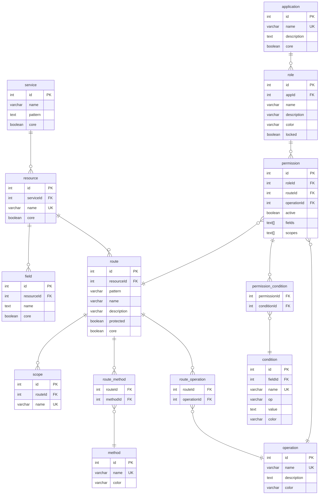
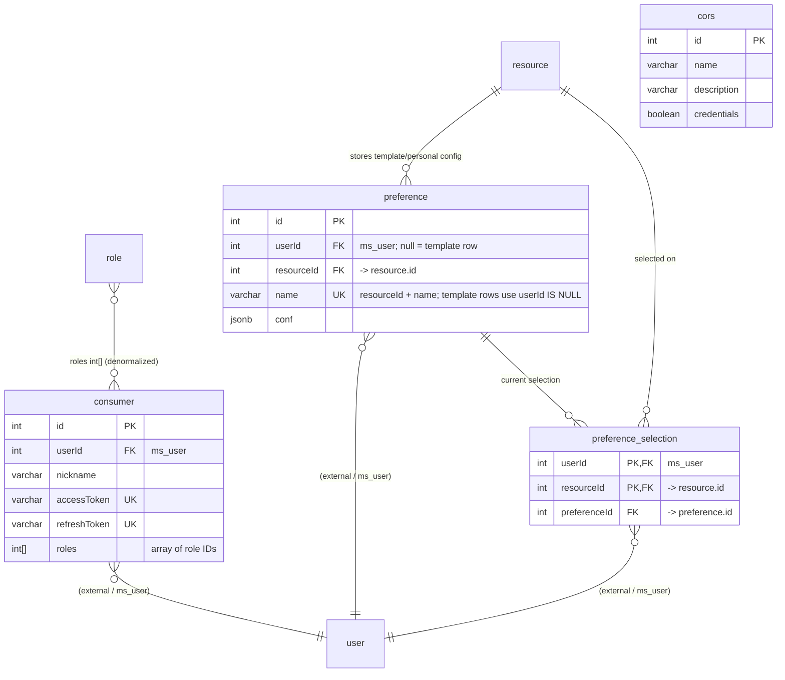

### Entity Relationship Diagram - Routes & ACL

```mermaid
erDiagram

  application ||--o{ role : ""
  service ||--o{ resource : ""
  role ||--o{ permission : ""
  resource ||--o{ field : ""
  resource ||--o{ route : ""
  route ||--o{ scope : ""
  route ||--o{ route_method : ""
  route_method }o--|| method : ""
  route ||--o{ route_operation : ""
  route_operation }o--|| operation : ""

  permission }o--|| route : ""
  permission }o--|| operation : ""
  permission ||--o{ permission_condition : ""
  permission_condition }o--|| condition : ""

  route_method {
    int routeId FK
    int methodId FK
  }

  route_operation {
    int routeId FK
    int operationId FK
  }
  application {
    int id PK
    varchar name UK
    text description
    boolean core
  }

  role {
    int id PK
    int appId FK
    varchar name
    varchar description
    varchar color
    boolean locked
  }

  permission {
    int id PK
    int roleId FK
    int routeId FK
    int operationId FK
    boolean active
    text[] fields
    text[] scopes
  }

  permission_condition {
    int permissionId FK
    int conditionId FK
  }

  condition {
    int id PK
    int fieldId FK
    varchar name UK
    varchar op
    text value
    varchar color
  }

  service {
    int id PK
    varchar name
    text pattern
    boolean core
  }

  resource {
    int id PK
    int serviceId FK
    varchar name UK
    boolean core
  }

  route {
    int id PK
    int resourceId FK
    varchar pattern
    varchar name
    varchar description
    boolean protected
    boolean core
  }

  method {
    int id PK
    varchar name UK
    varchar color
  }

  operation {
    int id PK
    varchar name UK
    text description
    varchar color
  }

  field {
    int id PK
    int resourceId FK
    text name
    boolean core
  }

  scope {
    int id PK
    int routeId FK
    varchar name UK
  }
```

### Entity Relationship Diagram - Consumer & Preferences

```mermaid
erDiagram
  role }o--o{ consumer : "roles int[] (denormalized)"
  consumer }o--|| user : "(external / ms_user)"
  preference }o--|| user : "(external / ms_user)"
  resource ||--o{ preference : "stores template/personal config"
  preference ||--o{ preference_selection : "current selection"
  preference_selection }o--|| user : "(external / ms_user)"
  resource ||--o{ preference_selection : "selected on"

  cors {
    int id PK
    varchar name
    varchar description
    boolean credentials
  }

  consumer {
    int id PK
    int userId FK "ms_user"
    varchar nickname
    varchar accessToken UK
    varchar refreshToken UK
    int[] roles "array of role IDs"
  }

  preference {
    int id PK
    int userId FK "ms_user; null = template row"
    int resourceId FK "-> resource.id"
    varchar name UK "resourceId + name; template rows use userId IS NULL"
    jsonb conf
  }

  preference_selection {
    int userId PK, FK "ms_user"
    int resourceId PK, FK "-> resource.id"
    int preferenceId FK "-> preference.id"
  }

  user {
  }

  role {
  }
```
