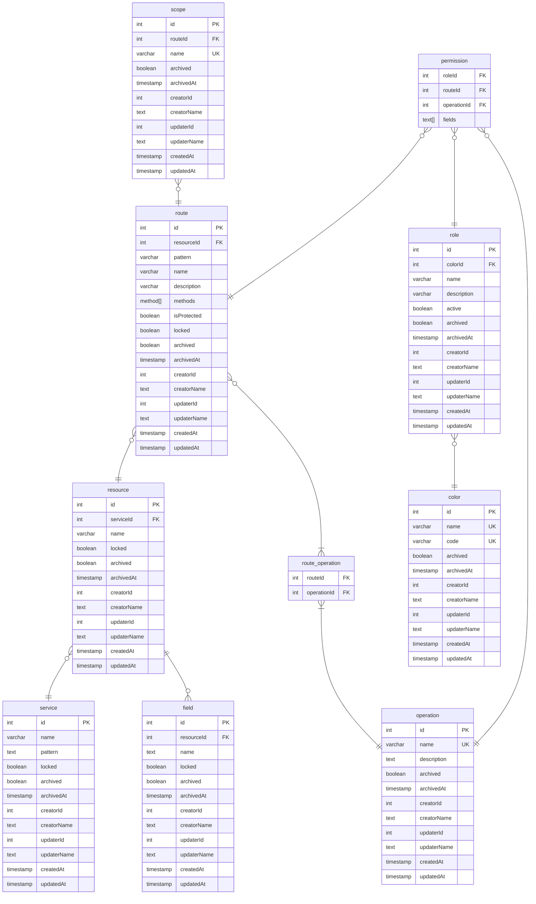
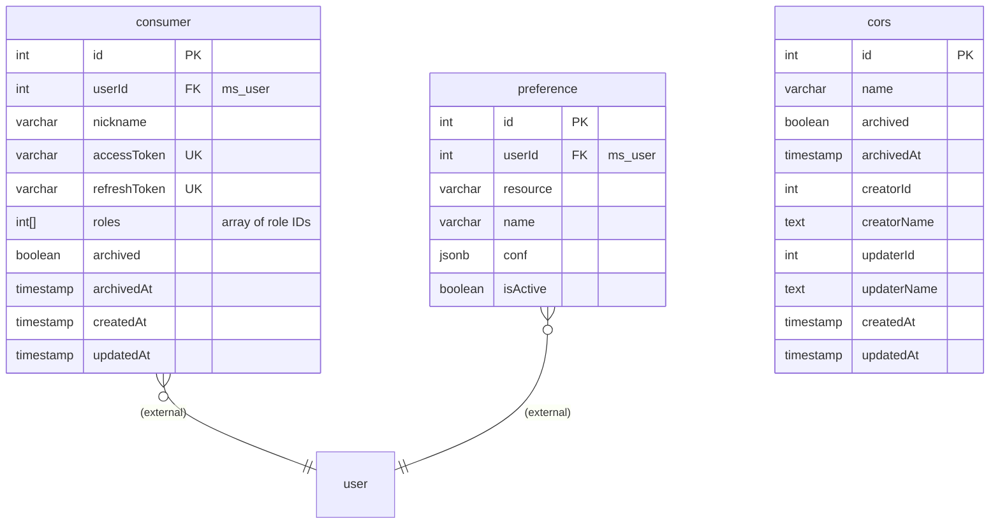

```mermaid
---
caption: Entity Relationship Diagram - Routes & ACL
---

erDiagram

  route }o--|| resource : ""
  resource }o--|| service : ""
  route }o--|{ route_operation : ""
  route_operation }|--|| operation : ""
  resource ||--o{ field : ""
  scope }o--|| route : ""
  permission }o--|| route : ""
  permission }o--|| operation : ""
  permission }o--|| role : ""
  role }o--|| color : ""

  color {
    int id PK
    varchar name UK
    varchar code UK
    boolean archived
    timestamp archivedAt
    int creatorId
    text creatorName
    int updaterId
    text updaterName
    timestamp createdAt
    timestamp updatedAt
  }

  role {
    int id PK
    int colorId FK
    varchar name
    varchar description
    boolean active
    boolean archived
    timestamp archivedAt
    int creatorId
    text creatorName
    int updaterId
    text updaterName
    timestamp createdAt
    timestamp updatedAt
  }

  permission {
    int roleId FK
    int routeId FK
    int operationId FK
    text[] fields
  }

  service {
    int id PK
    varchar name
    text pattern
    boolean locked
    boolean archived
    timestamp archivedAt
    int creatorId
    text creatorName
    int updaterId
    text updaterName
    timestamp createdAt
    timestamp updatedAt
  }

  resource {
    int id PK
    int serviceId FK
    varchar name
    boolean locked
    boolean archived
    timestamp archivedAt
    int creatorId
    text creatorName
    int updaterId
    text updaterName
    timestamp createdAt
    timestamp updatedAt
  }

  route {
    int id PK
    int resourceId FK
    varchar pattern
    varchar name
    varchar description
    method[] methods
    boolean isProtected
    boolean locked
    boolean archived
    timestamp archivedAt
    int creatorId
    text creatorName
    int updaterId
    text updaterName
    timestamp createdAt
    timestamp updatedAt
  }

  route_operation {
    int routeId FK
    int operationId FK
  }

  operation {
    int id PK
    varchar name UK
    text description
    boolean archived
    timestamp archivedAt
    int creatorId
    text creatorName
    int updaterId
    text updaterName
    timestamp createdAt
    timestamp updatedAt
  }

  field {
    int id PK
    int resourceId FK
    text name
    boolean locked
    boolean archived
    timestamp archivedAt
    int creatorId
    text creatorName
    int updaterId
    text updaterName
    timestamp createdAt
    timestamp updatedAt
  }

  scope {
    int id PK
    int routeId FK
    varchar name UK
    boolean archived
    timestamp archivedAt
    int creatorId
    text creatorName
    int updaterId
    text updaterName
    timestamp createdAt
    timestamp updatedAt
  }
```

```mermaid
---
caption: Entity Relationship Diagram - Consumer & Preferences
---

erDiagram

  consumer }o--|| user : "(external)"
  preference }o--|| user : "(external)"

  cors {
    int id PK
    varchar name
    boolean archived
    timestamp archivedAt
    int creatorId
    text creatorName
    int updaterId
    text updaterName
    timestamp createdAt
    timestamp updatedAt
  }

  consumer {
    int id PK
    int userId FK "ms_user"
    varchar nickname
    varchar accessToken UK
    varchar refreshToken UK
    int[] roles "array of role IDs"
    boolean archived
    timestamp archivedAt
    timestamp createdAt
    timestamp updatedAt
  }

  preference {
    int id PK
    int userId FK "ms_user"
    varchar resource
    varchar name
    jsonb conf
    boolean isActive
  }

  user {

  }
```
