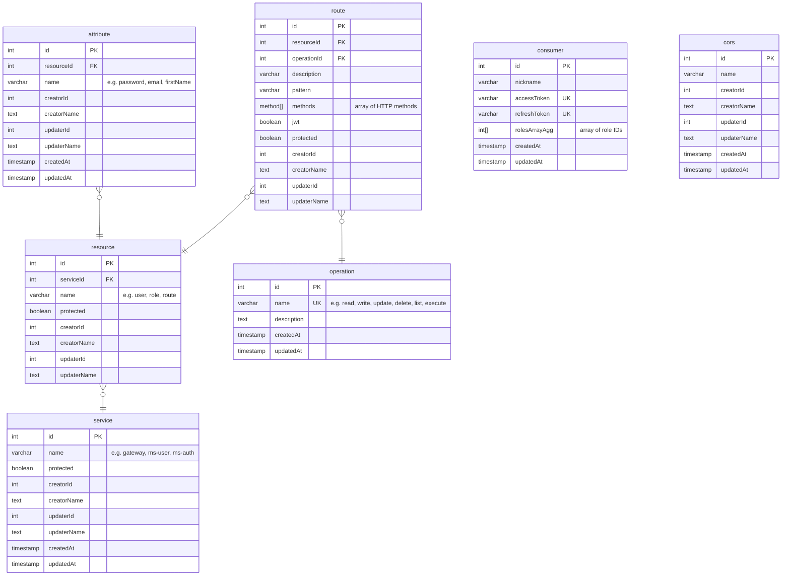

```mermaid
---
caption: Entity Relationship Diagram 
---

erDiagram
  
  route }o--|| resource : ""
  resource }o--|| service : ""
  route }o--|| operation : ""
  attribute }o--|| resource : ""
  consumer {
    int id PK
    varchar nickname
    varchar accessToken UK
    varchar refreshToken UK
    int[] rolesArrayAgg "array of role IDs"
    timestamp createdAt
    timestamp updatedAt
  }

  service {
    int id PK
    varchar name "e.g. gateway, ms-user, ms-auth"
    boolean protected
    int creatorId
    text creatorName
    int updaterId
    text updaterName
    timestamp createdAt
    timestamp updatedAt
  }

  cors {
    int id PK
    varchar name
    int creatorId
    text creatorName
    int updaterId
    text updaterName
    timestamp createdAt
    timestamp updatedAt
  }

  resource {
    int id PK
    int serviceId FK
    varchar name "e.g. user, role, route"
    boolean protected
    int creatorId
    text creatorName
    int updaterId
    text updaterName
  }

  route {
    int id PK
    int resourceId FK
    int operationId FK
    varchar description
    varchar pattern
    method[] methods "array of HTTP methods"
    boolean jwt
    boolean protected
    int creatorId
    text creatorName
    int updaterId
    text updaterName
  }

  operation {
    int id PK
    varchar name UK "e.g. read, write, update, delete, list, execute"
    text description
    timestamp createdAt
    timestamp updatedAt
  }

  attribute {
    int id PK
    int resourceId FK
    varchar name "e.g. password, email, firstName"
    int creatorId
    text creatorName
    int updaterId
    text updaterName
    timestamp createdAt
    timestamp updatedAt
  }

```