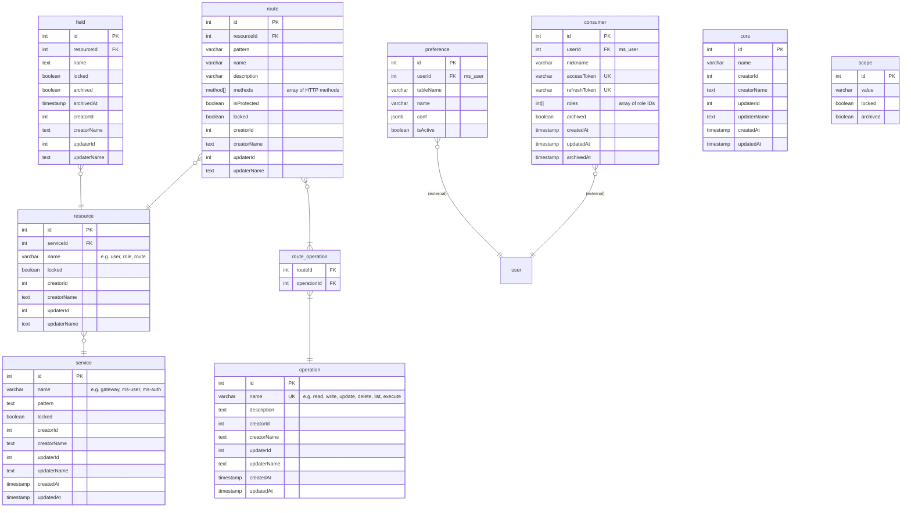

```mermaid
---
caption: Entity Relationship Diagram 
---

erDiagram
  
  route }o--|| resource : ""
  resource }o--|| service : ""
  route }o--|{ route_operation : ""
  route_operation }|--|| operation : ""
  field }o--|| resource : ""
  consumer }o--|| user : "(external)"
  preference }o--|| user : "(external)"
  consumer {
    int id PK
    int userId FK "ms_user"
    varchar nickname
    varchar accessToken UK
    varchar refreshToken UK
    int[] roles "array of role IDs"
    boolean archived
    timestamp createdAt
    timestamp updatedAt
    timestamp archivedAt
  }

  service {
    int id PK
    varchar name "e.g. gateway, ms-user, ms-auth"
    text pattern
    boolean locked
    int creatorId
    text creatorName
    int updaterId
    text updaterName
    timestamp createdAt
    timestamp updatedAt
  }

  cors {
    int id PK
    varchar name
    int creatorId
    text creatorName
    int updaterId
    text updaterName
    timestamp createdAt
    timestamp updatedAt
  }

  resource {
    int id PK
    int serviceId FK
    varchar name "e.g. user, role, route"
    boolean locked
    int creatorId
    text creatorName
    int updaterId
    text updaterName
  }

  route {
    int id PK
    int resourceId FK
    varchar pattern
    varchar name
    varchar description
    method[] methods "array of HTTP methods"
    boolean isProtected
    boolean locked
    int creatorId
    text creatorName
    int updaterId
    text updaterName
  }

  route_operation {
    int routeId FK
    int operationId FK
  }

  operation {
    int id PK
    varchar name UK "e.g. read, write, update, delete, list, execute"
    text description
    int creatorId
    text creatorName
    int updaterId
    text updaterName
    timestamp createdAt
    timestamp updatedAt
  }

  field {
    int id PK
    int resourceId FK
    text name
    boolean locked
    boolean archived
    timestamp archivedAt
    int creatorId
    text creatorName
    int updaterId
    text updaterName
  }

  scope {
    int id PK
    varchar value
    boolean locked
    boolean archived
  }

  preference {
    int id PK
    int userId FK "ms_user"
    varchar tableName
    varchar name
    jsonb conf
    boolean isActive
  }
  user {
    
  }
```
