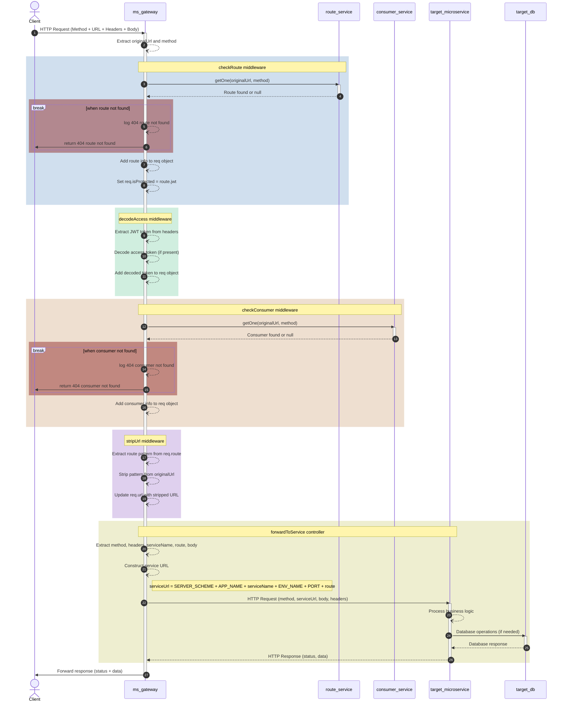

```mermaid
---
caption: Sequence diagram for proxy route call
---

sequenceDiagram
  autonumber
  actor c as Client
  participant gw as ms_gateway
  participant rs as route_service
  participant cs as consumer_service
  participant ms as target_microservice
  participant db as target_db
  
  c->>gw: HTTP Request (Method + URL + Headers + Body)
  activate gw
  
  gw--)gw: Extract originalUrl and method
  
  rect rgb(100, 150, 200, 0.3)
    note over gw,rs: checkRoute middleware
    gw->>rs: getOne(originalUrl, method)
    activate rs
    rs-->>gw: Route found or null
    deactivate rs
    
    rect rgb(150, 50, 50, 0.5)
      break when route not found
        gw--)gw: log 404 route not found
        gw->>c: return 404 route not found
      end
    end
    
    gw--)gw: Add route info to req object
    gw--)gw: Set req.isProtected = route.jwt
  end
  
  rect rgb(100, 200, 150, 0.3)
    note over gw: decodeAccess middleware
    gw--)gw: Extract JWT token from headers
    gw--)gw: Decode access token (if present)
    gw--)gw: Add decoded token to req object
  end
  
  rect rgb(200, 150, 100, 0.3)
    note over gw,cs: checkConsumer middleware
    gw->>cs: getOne(originalUrl, method)
    activate cs
    cs-->>gw: Consumer found or null
    deactivate cs
    
    rect rgb(150, 50, 50, 0.5)
      break when consumer not found
        gw--)gw: log 404 consumer not found
        gw->>c: return 404 consumer not found
      end
    end
    
    gw--)gw: Add consumer info to req object
  end
  
  rect rgb(150, 100, 200, 0.3)
    note over gw: stripUrl middleware
    gw--)gw: Extract route pattern from req.route
    gw--)gw: Strip pattern from originalUrl
    gw--)gw: Update req.url with stripped URL
  end
  
  rect rgb(200, 200, 100, 0.3)
    note over gw,ms: forwardToService controller
    gw--)gw: Extract method, headers, serviceName, route, body
    gw--)gw: Construct service URL
    note right of gw: serviceUrl = SERVER_SCHEME + APP_NAME + serviceName + ENV_NAME + PORT + route
    
    gw->>ms: HTTP Request (method, serviceUrl, body, headers)
    activate ms
    
    ms--)ms: Process business logic
    ms->>db: Database operations (if needed)
    activate db
    db-->>ms: Database response
    deactivate db
    
    ms-->>gw: HTTP Response (status, data)
    deactivate ms
  end
  
  gw->>c: Forward response (status + data)
  deactivate gw
```