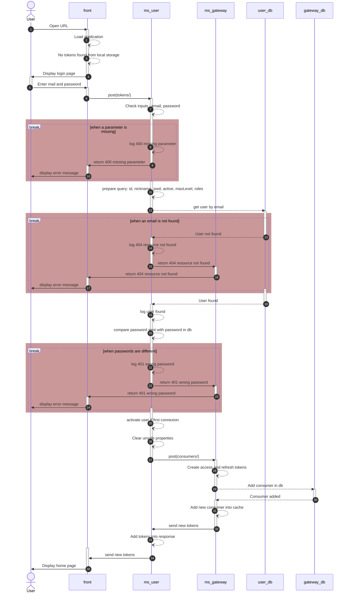

```mermaid
---
caption: Diagramme de séquence de la connexion utilisateur
---

sequenceDiagram
  autonumber
  actor u as User
  participant f as front
  participant msu as ms_user
  participant msg as ms_gateway
  participant udb as user_db
  participant gdb as gateway_db
  u->>f: Open URL
  activate f
  f--)f: Load application
  f--)f: No tokens found from local storage
  f->>u: Display login page
  deactivate f
  activate u
  u->>f: Enter mail and password
  deactivate u
  activate f
  f->>msu: post(tokens/)
  deactivate f
  activate msu
  msu--)msu: Check inputs : email, password
  rect rgb(150, 50, 50, 0.5)
    break when a parameter is missing
      msu--)msu: log 400 missing parameter
      msu->>f: return 400 missing parameter
      deactivate msu
      activate f
      f->>u: display error message
      deactivate f
    end
  end
  activate msu
  msu--)msu: prepare query: id, nickname, pwd, active, maxLevel, roles
  msu-->>udb: get user by email
  deactivate msu
  activate udb
  rect rgb(150, 50, 50, 0.5) 
    break when an email is not found
      udb-->>msu: User not found
      deactivate udb
      activate msu
      msu--)msu: log 404 resource not found
      msu->>msg: return 404 resource not found
      deactivate msu
      activate msg
      msg->>f: return 404 resource not found
      deactivate msg
      activate f
      f->>u: display error message
      deactivate f   
      activate udb
    end
  end
  
  udb-->>msu: User found
  deactivate udb
  activate msu
  msu--)msu: log user found
  msu--)msu: compare password sent with password in db
  rect rgb(150, 50, 50, 0.5)
    break when passwords are different
      msu--)msu: log 401 wrong password
      msu->>msg: return 401 wrong password
      deactivate msu
      activate msg
      msg->>f: return 401 wrong password
      deactivate msg
      activate f
      f->>u: display error message
      deactivate f
      activate msu
    end
  end
  msu--)msu: activate user if first connexion
  msu--)msu: Clear unsafe properties
  msu->>msg: post(consumers/)
  deactivate msu
  activate msg
  msg--)msg: Create access and refresh tokens
  msg-->>gdb: Add consumer in db
  deactivate msg
  activate gdb
  gdb-->>msg: Consumer added
  deactivate gdb
  activate msg
  msg--)msg: Add new consumer into cache
  msg->>msu: send new tokens
  deactivate msg
  activate msu
  msu--)msu: Add tokens into response
  activate f
  msu->>f: send new tokens
  f->>u: Display home page
  deactivate f 
```
