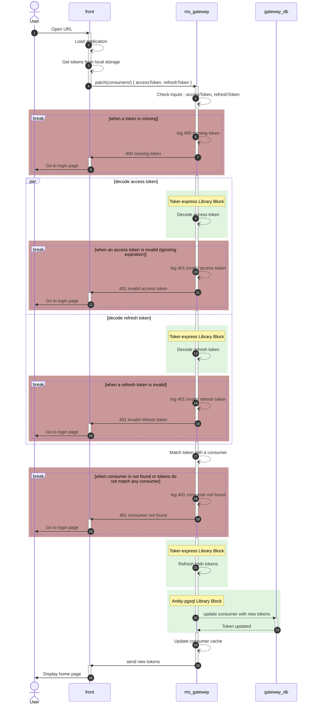

```mermaid
---
caption: Refresh Token
---

sequenceDiagram
  autonumber
  actor u as User
  participant f as front
  participant msg as ms_gateway
  participant db as gateway_db
  u->>f: Open URL
  activate f
  f--)f: Load application
  f--)f: Get tokens from local storage
  f->>msg: patch(consumers/) { accessToken, refreshToken }
  deactivate f
  activate msg
  msg--)msg: Check inputs : accessToken, refreshToken
  rect rgb(150, 50, 50, 0.5)
    break when a token is missing
      msg--)msg: log 400 missing token
      msg->>f: 400 missing token
      deactivate msg
      activate f
      f->>u: Go to login page
      deactivate f
    end
  end
  activate msg
  
  par decode access token
    rect rgb(100, 200, 100, 0.2)
      note over msg: Toker-express Library Block
      msg--)msg: Decode access token
    end
    rect rgb(150, 50, 50, 0.5)
      break when an access token is invalid (ignoring expiration)
        msg--)msg: log 401 invalid access token
        msg->>f: 401 invalid access token
        deactivate msg
        activate f
        f->>u: Go to login page
        deactivate f
      end
    end
    activate msg

  and decode refresh token
    rect rgb(100, 200, 100, 0.2)
      note over msg: Toker-express Library Block
      msg--)msg: Decode refresh token
    end
    rect rgb(150, 50, 50, 0.5)
      break when a refresh token is invalid 
        msg--)msg: log 401 invalid refresh token
        msg->>f: 401 invalid refresh token
        deactivate msg
        activate f
        f->>u: Go to login page
        deactivate f
      end
    end
    activate msg

  end 
  
  msg--)msg: Match token with a consumer
  rect rgb(150, 50, 50, 0.5)
    break when consumer is not found or tokens do not match any consumer
      msg--)msg: log 401 consumer not found
      msg->>f: 401 consumer not found
      deactivate msg
      activate f
      f->>u: Go to login page
      deactivate f
    end
  end
  activate msg
  rect rgb(100, 200, 100, 0.2)
    note over msg: Toker-express Library Block
    msg--)msg: Refresh both tokens
  end
  rect rgb(100, 200, 100, 0.2)
    note over msg: Antity-pgsql Library Block
    msg-->>db: update consumer with new tokens
    deactivate msg
    activate db
    db-->>msg: Token updated
  end
  deactivate db
  activate msg
  msg--)msg: Update consumer cache
  msg->>f: send new tokens
  deactivate msg
  activate f
  f->>u: Display home page
  deactivate f 
```
