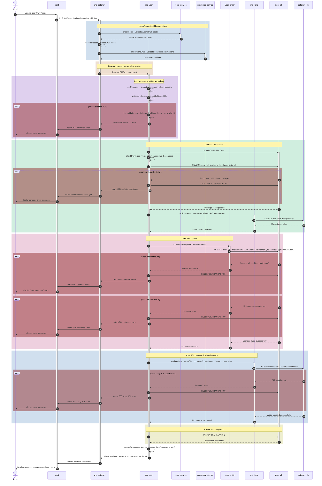

```mermaid
---
caption: Sequence diagram for admin updating a user
---

sequenceDiagram
  autonumber
  actor a as Admin
  participant f as front
  participant gw as ms_gateway
  participant us as ms_user
  participant rs as route_service
  participant cs as consumer_service
  participant ue as user_entity
  participant kong as ms_kong
  participant udb as user_db
  participant gdb as gateway_db
  
  a->>f: Update user (PUT /users)
  activate f
  
  f->>gw: PUT /api/users (updated user data with IDs)
  activate gw
  
  rect rgb(100, 150, 200, 0.3)
    note over gw,cs: checkRequest middleware stack
    gw->>rs: checkRoute - validate /users PUT exists
    activate rs
    rs-->>gw: Route found and validated
    deactivate rs
    
    gw--)gw: decodeAccess - extract JWT token
    
    gw->>cs: checkConsumer - validate consumer permissions
    activate cs
    cs-->>gw: Consumer validated
    deactivate cs
  end
  
  rect rgb(200, 150, 100, 0.3)
    note over gw,us: Forward request to user microservice
    gw->>us: Forward PUT /users request
    activate us
  end
  
  rect rgb(150, 100, 200, 0.3)
    note over us: User processing middleware stack
    us--)us: getConsumer - extract consumer info from headers
    
    us--)us: validate - check user input fields and IDs
    
    rect rgb(150, 50, 50, 0.5)
      break when validation fails
        us--)us: log validation error (missing firstName, lastName, invalid ID)
        us->>gw: return 400 validation error
        gw->>f: return 400 validation error
        f->>a: display error message
      end
    end
  end
  
  rect rgb(100, 200, 150, 0.3)
    note over us,udb: Database transaction
    us->>udb: BEGIN TRANSACTION
    activate udb
    
    us->>us: checkPrivileges - verify admin can update these users
    activate us
    
    us->>udb: SELECT users with maxLevel < updater.maxLevel
    
    rect rgb(150, 50, 50, 0.5)
      break when privilege check fails
        udb-->>us: Found users with higher privileges
        us->>udb: ROLLBACK TRANSACTION
        us->>gw: return 400 insufficient privileges
        gw->>f: return 400 insufficient privileges
        f->>a: display privilege error message
      end
    end
    
    udb-->>us: Privilege check passed
    deactivate us
    
    us->>kong: getRoles - get current user roles for ACL comparison
    activate kong
    kong->>gdb: SELECT user roles from gateway
    activate gdb
    gdb-->>kong: Current user roles
    deactivate gdb
    kong-->>us: Current roles retrieved
    deactivate kong
  end
  
  rect rgb(200, 100, 150, 0.3)
    note over us,ue: User data update
    us->>ue: updateMany - update user information
    activate ue
    
    ue->>udb: UPDATE users SET firstName=?, lastName=?, nickname=?, rolesArrayAgg=? WHERE id=?
    
    rect rgb(150, 50, 50, 0.5)
      break when user not found
        udb-->>ue: No rows affected (user not found)
        ue-->>us: User not found error
        us->>udb: ROLLBACK TRANSACTION
        us->>gw: return 404 user not found
        gw->>f: return 404 user not found
        f->>a: display "user not found" error
      end
    end
    
    rect rgb(150, 50, 50, 0.5)
      break when database error
        udb-->>ue: Database constraint error
        ue-->>us: Database error
        us->>udb: ROLLBACK TRANSACTION
        us->>gw: return 500 database error
        gw->>f: return 500 database error
        f->>a: display error message
      end
    end
    
    udb-->>ue: Users updated successfully
    ue-->>us: Update successful
    deactivate ue
  end
  
  rect rgb(100, 150, 200, 0.3)
    note over us,kong: Kong ACL updates (if roles changed)
    us->>kong: updateConsumersACLs - update API permissions based on new roles
    activate kong
    
    kong->>gdb: UPDATE consumer ACLs for modified users
    activate gdb
    
    rect rgb(150, 50, 50, 0.5)
      break when Kong ACL update fails
        gdb-->>kong: ACL update error
        kong-->>us: Kong ACL error
        us->>udb: ROLLBACK TRANSACTION
        us->>gw: return 500 Kong ACL error
        gw->>f: return 500 Kong ACL error
        f->>a: display error message
      end
    end
    
    gdb-->>kong: ACLs updated successfully
    deactivate gdb
    kong-->>us: ACL update successful
    deactivate kong
  end
  
  rect rgb(200, 200, 100, 0.3)
    note over us,udb: Transaction completion
    us->>udb: COMMIT TRANSACTION
    udb-->>us: Transaction committed
    deactivate udb
  end
  
  us--)us: secureResponse - remove sensitive data (passwords, etc.)
  
  us->>gw: 200 OK (updated user data without sensitive fields)
  deactivate us
  
  gw->>f: 200 OK (secured user data)
  deactivate gw
  
  f->>a: Display success message & updated users
  deactivate f
```