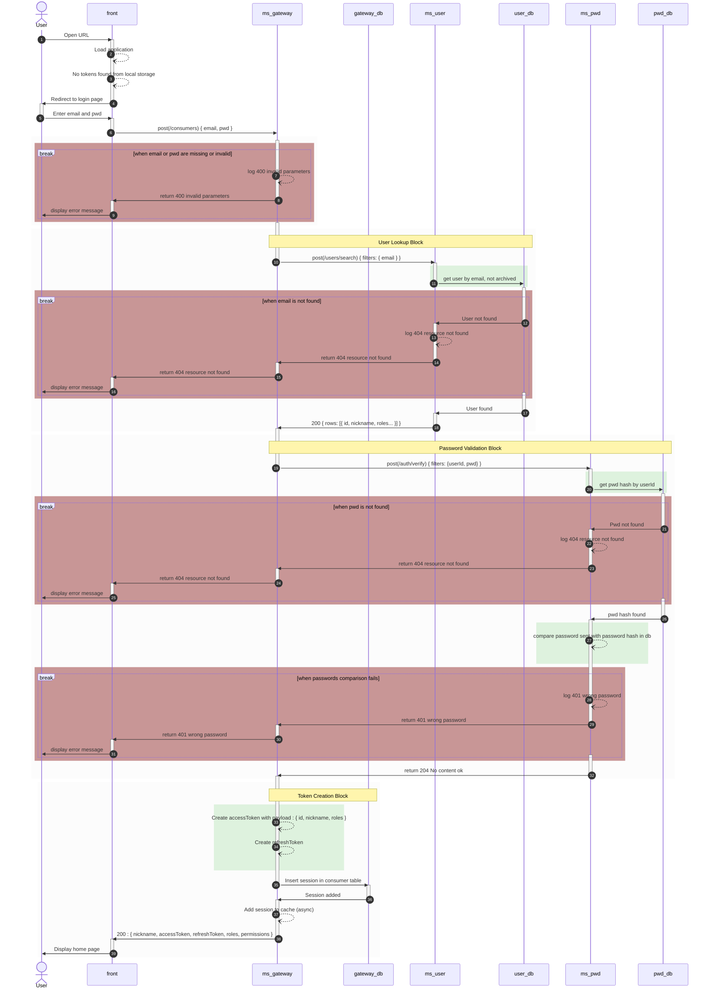

# Sessions

Session endpoints manage authentication — login, token refresh, and logout.

## Login

### API

```
POST /gateway/sessions
Content-Type: application/json

{
  "email": "user@example.com",
  "pwd": "password"
}
```

**Response (200 OK):**
```json
{
  "accessToken": "eyJhbGc...",
  "refreshToken": "eyJhbGc...",
  "permissions": [
    { "route": "routeName", "operations": [1, 2], "fields": null }
  ]
}
```


### Sequence diagram 




## Refresh Tokens

```
PUT /gateway/sessions
Content-Type: application/json
Authorization: Bearer <refresh_token>

{
  "refreshToken": "eyJhbGc..."
}
```

**Response (200 OK):**
```json
{
  "accessToken": "new_access_token",
  "refreshToken": "new_refresh_token",
  "permissions": [
    { "route": "routeName", "operations": [1, 2], "fields": null }
  ]
}
```

## Logout

```
DELETE /gateway/sessions
Authorization: Bearer <access_token>
```

**Response (204 No Content)**
