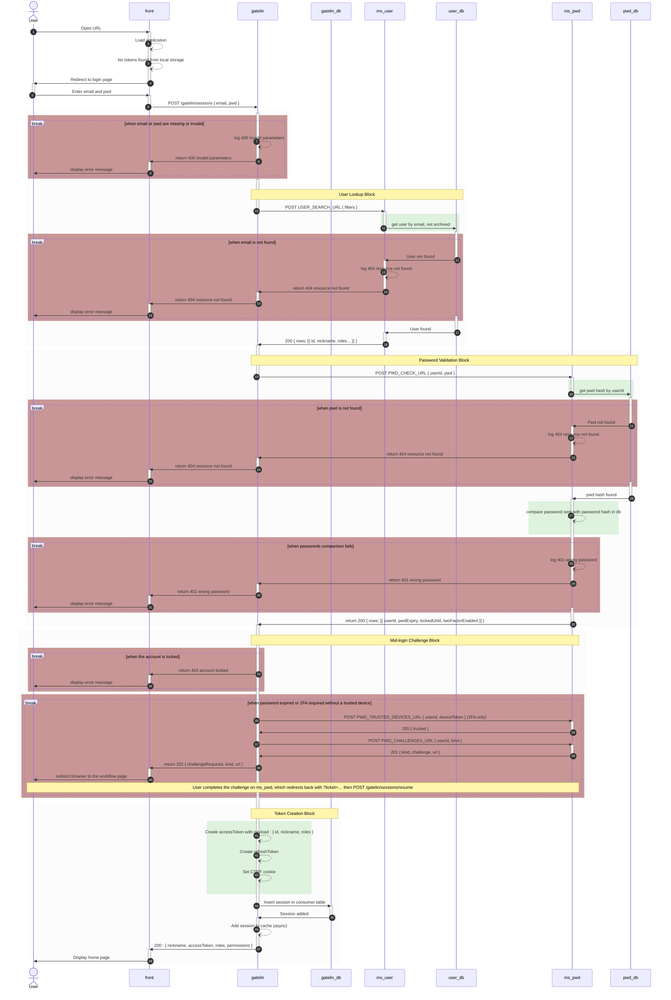

# Sessions

Session endpoints manage authentication — login, mid-login challenge resume, token refresh, and logout.

## Login

### API

```
POST /gatelin/sessions
Content-Type: application/json

{
  "email": "user@example.com",
  "pwd": "password"
}
```

**Response (200 OK)** — password accepted and no mid-login challenge required:

```json
{
  "nickname": "jane",
  "accessToken": "eyJhbGc...",
  "roles": [1, 2],
  "permissions": [
    { "route": 4, "operations": [1, 2], "fields": [], "scopes": [] }
  ]
}
```

A CSRF cookie (`csrfToken` by default) is also set. When `REFRESH_TOKEN_COOKIE` is enabled, the refresh token is stored as an httpOnly cookie (and omitted from the JSON body when marked private).

**Response (202 Accepted)** — password accepted, but a mid-login challenge must be completed first:

```json
{
  "challengeRequired": true,
  "kind": "2fa",
  "url": "https://example.com/api/pwd/web/2fa/verify?challenge=…"
}
```

| `kind` | When it is returned |
|---|---|
| `expired-password` | The account's password has expired |
| `2fa` | Two-factor is enabled and the browser has no valid trusted-device cookie |

The client must send the browser to `url`. That URL is served entirely by **your** password service — Gatelin does not render or control it. When the workflow finishes, your service redirects the browser back to the admin login with `?ticket=…`, and the frontend calls [Resume](#resume) to create the session.

**Other error statuses:**

| Status | Meaning |
|---|---|
| `400` | Missing or invalid `email` / `pwd` |
| `401` | Wrong credentials |
| `403` | Account locked |
| `404` | User not found |

### Password-service contract

Gatelin never stores password hashes or 2FA secrets, and never renders challenge pages. It delegates all of that to a **password service** you point `PWD_CHECK_URL` at. Any service that speaks the small HTTP contract below works.

#### Credential check (required)

`PWD_CHECK_URL` is the only endpoint Gatelin always calls. On a correct password it must return **HTTP 200** with a single user row:

```json
{
  "rows": [{
    "userId": 42,
    "pwdExpiry": null,
    "lockedUntil": null,
    "twoFactorEnabled": false
  }],
  "total": 1
}
```

On a wrong password it must return a non-2xx status (typically `401`).

Gatelin reads only these fields from `rows[0]`; any others are ignored:

| Field | Type | Effect on login |
|---|---|---|
| `lockedUntil` | ISO date string or `null` | If in the future, login is rejected with **403** |
| `pwdExpiry` | ISO date string or `null` | If in the past, login returns **202** `expired-password` |
| `twoFactorEnabled` | boolean | If `true` (and no trusted-device cookie), login returns **202** `2fa` |

> **Don't need challenges?** If your service only checks passwords, return a body **without a `rows` entry** (for example `{ "success": true }`, or `{ "rows": [], "total": 0 }`). Gatelin then treats the login as fully authenticated, skips all gating, and logs a debug/warn note. This is the correct setup for a plain username+password login with no 2FA or password-expiry policy.

#### Challenge endpoints (only if you emit 202)

If your credential check can return `pwdExpiry`, `lockedUntil`, or `twoFactorEnabled`, then Gatelin also needs the endpoints below. Each one has its own environment variable — nothing is derived from `PWD_CHECK_URL`, so you are free to name and place these routes however you like:

| Variable | Request body | Expected response | Called when |
|---|---|---|---|
| `PWD_CHALLENGES_URL` | `{ userId, kind }` | `{ url, kind }` — `url` is the browser page that runs the challenge | A challenge is required |
| `PWD_TRUSTED_DEVICES_URL` | `{ userId, deviceToken }` | `{ trusted: boolean }` | 2FA is enabled and a trusted-device cookie is present |
| `PWD_LOGIN_TICKET_URL` | `{ ticket }` | `{ userId }` | The frontend calls [Resume](#resume) |

All three are POST endpoints and all three may be empty. Gatelin still boots and password login still succeeds. Empty `PWD_CHALLENGES_URL` skips 2FA and password-expiry pages (a warn is logged). Empty `PWD_TRUSTED_DEVICES_URL` ignores the trusted-device cookie. Empty `PWD_LOGIN_TICKET_URL` makes [Resume](#resume) answer **501**.

#### Trusted-device cookie

To let a returning browser skip 2FA, your challenge pages may set a trusted-device cookie named **`trusted_device`** (scoped `Path=/` so it reaches `/gatelin/sessions`). On the next login Gatelin forwards its value to `PWD_TRUSTED_DEVICES_URL`; a `{ trusted: true }` response suppresses the 2FA challenge. If you don't implement trusted devices, simply never set the cookie — every 2FA login then challenges.

### Sequence diagram



## Resume

Finishes a login that was interrupted by a mid-login challenge. Public — no JWT required.

```
POST /gatelin/sessions/resume
Content-Type: application/json

{
  "ticket": "one-shot-login-resume-ticket"
}
```

Gatelin redeems the ticket against the password service (`POST PWD_LOGIN_TICKET_URL`), looks the user up by id, then runs the same token / session / CSRF path as a successful login.

**Response (200 OK):** same session payload as [Login](#login).

| Status | Meaning |
|---|---|
| `400` | Missing, invalid, or already-consumed ticket |
| `422` | Ticket redeemed but the user lookup failed |

Tickets are one-shot and short-lived. The admin UI reads `?ticket=` on the login page and calls this endpoint automatically.

## Refresh Tokens

```
PUT /gatelin/sessions
Content-Type: application/json
Authorization: Bearer <access_token>
X-CSRF-Token: <csrf_cookie_value>
Cookie: csrfToken=<csrf_cookie_value>; refreshToken=<optional>

{
  "refreshToken": "eyJhbGc..."
}
```

The access token may already be expired — refresh ignores expiration after CSRF and refresh-token checks pass. The refresh token may be supplied in the JSON body and/or the refresh-token cookie.

**Response (200 OK):**
```json
{
  "nickname": "jane",
  "accessToken": "new_access_token",
  "refreshToken": "new_refresh_token",
  "roles": [1, 2],
  "permissions": [
    { "route": 4, "operations": [1, 2], "fields": [], "scopes": [] }
  ]
}
```

A fresh CSRF cookie is issued with the new tokens.

## Logout

```
DELETE /gatelin/sessions
Authorization: Bearer <access_token>
X-CSRF-Token: <csrf_cookie_value>
Cookie: csrfToken=<csrf_cookie_value>
```

**Response (204 No Content)**

The consumer session is archived, removed from the cache, and refresh/CSRF cookies are cleared.
