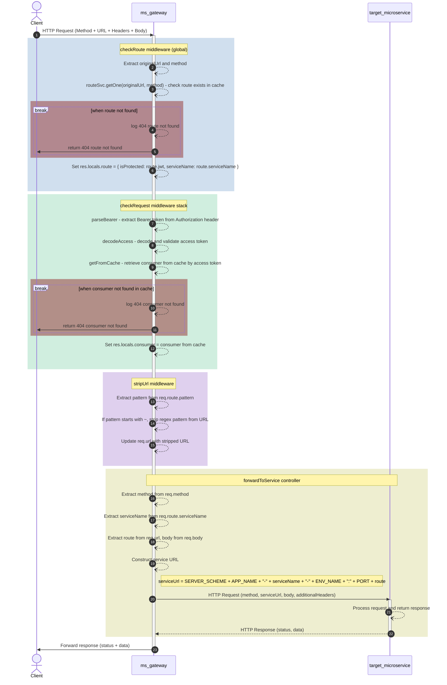

# Proxy Request

```mermaid
---
caption: Sequence diagram for proxy route call
---

sequenceDiagram
  autonumber
  actor c as Client
  participant gw as ms_gateway
  participant ms as target_microservice
  
  c->>gw: HTTP Request (Method + URL + Headers + Body)
  activate gw
  
  rect rgb(100, 150, 200, 0.3)
    note over gw: checkRoute middleware (global)
    gw--)gw: Extract originalUrl and method
    gw--)gw: routeSvc.getOne(originalUrl, method) - check route exists in cache
    
    rect rgb(150, 50, 50, 0.5)
      break when route not found
        gw--)gw: log 404 route not found
        gw->>c: return 404 route not found
      end
    end
    
    gw--)gw: Set res.locals.route = { isProtected: route.jwt, serviceName: route.serviceName }
  end
  
  rect rgb(100, 200, 150, 0.3)
    note over gw: checkRequest middleware stack
    gw--)gw: parseBearer - extract Bearer token from Authorization header
    gw--)gw: decodeAccess - decode and validate access token
    gw--)gw: getFromCache - retrieve consumer from cache by access token
    
    rect rgb(150, 50, 50, 0.5)
      break when consumer not found in cache
        gw--)gw: log 404 consumer not found
        gw->>c: return 404 consumer not found
      end
    end
    
    gw--)gw: Set res.locals.consumer = consumer from cache
  end
  
  rect rgb(150, 100, 200, 0.3)
    note over gw: stripUrl middleware
    gw--)gw: Extract pattern from req.route.pattern
    gw--)gw: If pattern starts with ~, strip regex pattern from URL
    gw--)gw: Update req.url with stripped URL
  end
  
  rect rgb(200, 200, 100, 0.3)
    note over gw,ms: forwardToService controller
    gw--)gw: Extract method from req.method
    gw--)gw: Extract serviceName from req.route.serviceName
    gw--)gw: Extract route from req.url, body from req.body
    gw--)gw: Construct service URL
    note right of gw: serviceUrl = SERVER_SCHEME + APP_NAME + "-" + serviceName + "-" + ENV_NAME + ":" + PORT + route
    
    gw->>ms: HTTP Request (method, serviceUrl, body, additionalHeaders)
    activate ms
    
    ms--)ms: Process request and return response
    
    ms-->>gw: HTTP Response (status, data)
    deactivate ms
  end
  
  gw->>c: Forward response (status + data)
  deactivate gw
```
