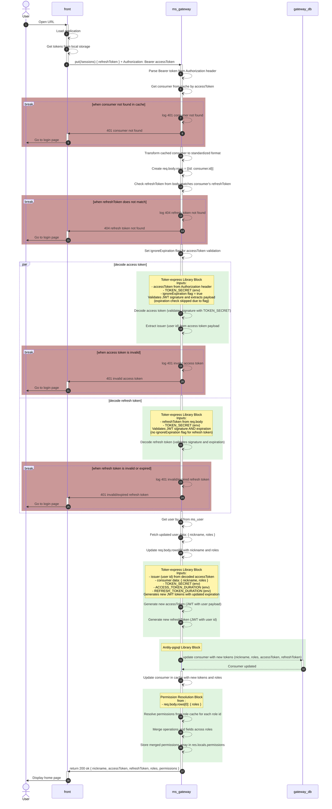

# Update Session

```mermaid
---
caption: Sequence diagram for session token refresh
---

sequenceDiagram
  autonumber
  actor u as User
  participant f as front
  participant msg as ms_gateway
  participant db as gateway_db
  u->>f: Open URL
  activate f
  f--)f: Load application
  f--)f: Get tokens from local storage
  f->>msg: put(/sessions) { refreshToken } + Authorization: Bearer accessToken
  deactivate f
  activate msg
  msg--)msg: Parse Bearer token from Authorization header
  msg--)msg: Get consumer from cache by accessToken
  rect rgb(150, 50, 50, 0.5)
    break when consumer not found in cache
      msg--)msg: log 401 consumer not found
      msg->>f: 401 consumer not found
      deactivate msg
      activate f
      f->>u: Go to login page
      deactivate f
    end
  end
  activate msg
  msg--)msg: Transform cached consumer to standardized format
  msg--)msg: Create req.body.rows = [{id: consumer.id}]
  msg--)msg: Check refreshToken from body matches consumer's refreshToken
  rect rgb(150, 50, 50, 0.5)
    break when refreshToken does not match
      msg--)msg: log 404 refresh token not found
      msg->>f: 404 refresh token not found
      deactivate msg
      activate f
      f->>u: Go to login page
      deactivate f
    end
  end
  activate msg
  msg--)msg: Set ignoreExpiration flag for accessToken validation
  
  par decode access token
    rect rgb(100, 200, 100, 0.2)
      note over msg: Toker-express Library Block<br/>Inputs:<br/>- accessToken from Authorization header<br/>- TOKEN_SECRET (env)<br/>- ignoreExpiration flag = true<br/>Validates JWT signature and extracts payload<br/>(expiration check skipped due to flag)
      msg--)msg: Decode access token (validates signature with TOKEN_SECRET)
      msg--)msg: Extract issuer (user id) from access token payload
    end
    rect rgb(150, 50, 50, 0.5)
      break when access token is invalid
        msg--)msg: log 401 invalid access token
        msg->>f: 401 invalid access token
        deactivate msg
        activate f
        f->>u: Go to login page
        deactivate f
      end
    end
    activate msg

  and decode refresh token
    rect rgb(100, 200, 100, 0.2)
      note over msg: Toker-express Library Block<br/>Inputs:<br/>- refreshToken from req.body<br/>- TOKEN_SECRET (env)<br/>Validates JWT signature AND expiration<br/>(no ignoreExpiration flag for refresh token)
      msg--)msg: Decode refresh token (validates signature and expiration)
    end
    rect rgb(150, 50, 50, 0.5)
      break when refresh token is invalid or expired
        msg--)msg: log 401 invalid/expired refresh token
        msg->>f: 401 invalid/expired refresh token
        deactivate msg
        activate f
        f->>u: Go to login page
        deactivate f
      end
    end
    activate msg

  end 
  
  msg--)msg: Get user by id from ms_user
  msg--)msg: Fetch updated user data: { nickname, roles }
  msg--)msg: Update req.body.rows[0] with nickname and roles
  
  rect rgb(100, 200, 100, 0.2)
    note over msg: Toker-express Library Block<br/>Inputs:<br/>- issuer (user id) from decoded accessToken<br/>- consumer data: { nickname, roles }<br/>- TOKEN_SECRET (env)<br/>- ACCESS_TOKEN_DURATION (env)<br/>- REFRESH_TOKEN_DURATION (env)<br/>Generates new JWT tokens with updated expiration
    msg--)msg: Generate new accessToken (JWT with user payload)
    msg--)msg: Generate new refreshToken (JWT with user id)
  end
  rect rgb(100, 200, 100, 0.2)
    note over msg: Antity-pgsql Library Block
    msg-->>db: update consumer with new tokens (nickname, roles, accessToken, refreshToken)
    deactivate msg
    activate db
    db-->>msg: Consumer updated
  end
  deactivate db
  activate msg
  msg--)msg: Update consumer in cache with new tokens and roles
  rect rgb(100, 200, 100, 0.2)
    note over msg: Permission Resolution Block<br/>from :<br/>- req.body.rows[0]: { roles }
    msg--)msg: Resolve permissions from role cache for each role id
    msg--)msg: Merge operations and fields across roles
    msg--)msg: Store merged permissions array in res.locals.permissions
  end
  msg->>f: return 200 ok { nickname, accessToken, refreshToken, roles, permissions }
  deactivate msg
  activate f
  f->>u: Display home page
  deactivate f
```
